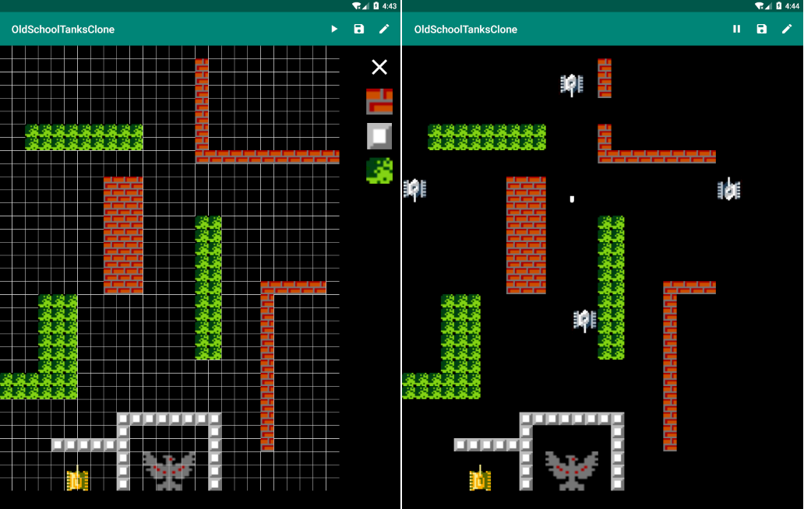
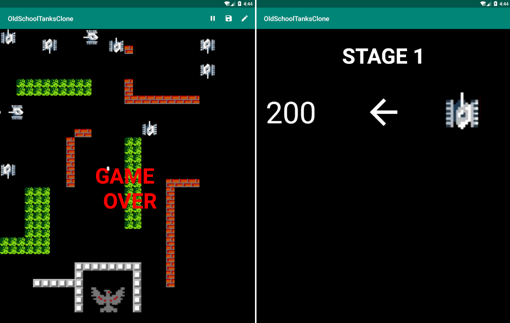

# OldSchoolTanksClone
A clone of the game BattleCity on the console Dendy. So far, it runs on the emulator and is controlled by the keyboard.

The app has two screens: a game screen and a scoring screen.

The main screen of the game can be in several states:
* Level edit mode
* Game mode

It is also possible to pause the game or save the created level in memory.

After the end of the game, "Game Over" is displayed and the points for the round are calculated.

